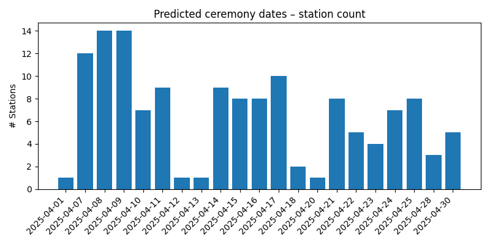
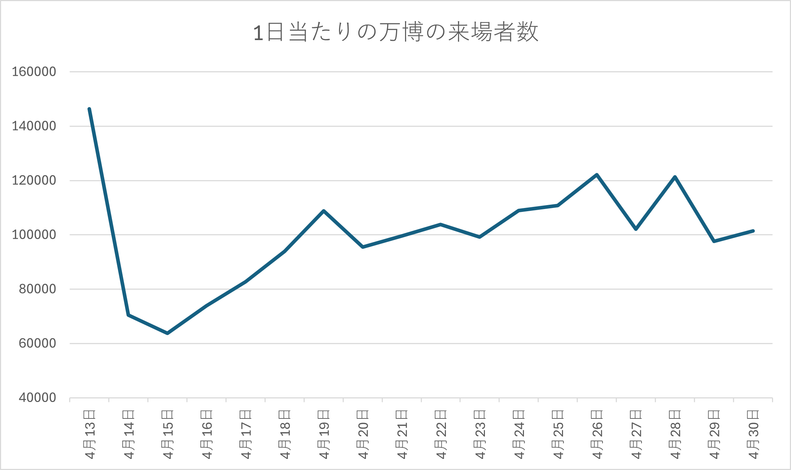
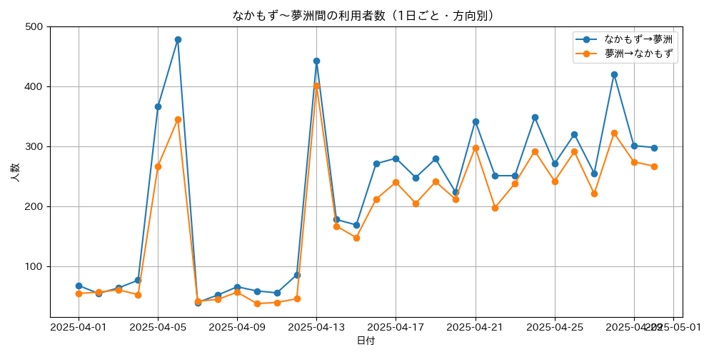

# 大阪メトロ乗降客データと周辺イベントの関連性分析

**作成日:** 2025年7月15日
**作成者:** BGA25082 前田武志

---

## 1. はじめに

主な分析対象として，以下の2点に焦点を当てた．
- **学校イベントの影響**: 4月の新学期シーズンにおける通学利用者の動向を把握するため，駅周辺の学校情報と乗降客データを組み合わせ，授業開始日を推定した．
- **万博開催の影響予測**: 2025年4月のの大阪・関西万博開催の影響と，「なかもず」駅と会場最寄り駅である「夢洲」駅との間の乗降客数の関係性を分析した．

---

## 2. 分析の前提

本分析で利用した乗降客データ（`202504-Nakamozu-OD.csv`）には170駅が含まれている．一方で，大阪メトロの[公式路線図](https://subway.osakametro.co.jp/guide/routemap.php)に掲載されている駅数は157駅であり，両者には差異が存在した．

- **提供データ内の駅数**: 170駅
- **大阪メトロ公式駅数**: 157駅

提供データには含まれるが公式路線図にはない13駅は以下の通りである．
`一分`, `南方`, `大阪梅田`, `大阪難波`, `学園前`, `宝塚`, `富雄`, `崇禅寺`, `新祝園`, `東山`, `菖蒲池`, `萩の台`, `高の原`

これらの駅は他社線との乗り入れ駅などが含まれると考えられる．本分析では，大阪メトロの動向に焦点を絞るため，分析対象を公式の157駅に限定した．

---

## 3. 分析手法

### 3.1. 授業開始日の推定 (`get_school_loc/`, `analyze_school`)

駅周辺の学校の立地情報を取得し，通学需要の基礎データを作成した．

- **`get_station_loc.py`**: 大阪メトロ157駅の駅名リストに基づき，緯度・経度情報を取得．
- **`find_schools_within_radius.py`**: 各駅を中心とした半径800m（徒歩約10分圏内）に存在する中学校，高等学校，大学を検索し，リスト化 (`schools_within_800m.csv`)．
- **`build_station_school_kml.py`**: 駅，検索範囲，学校の位置関係を可視化するためのKMLファイル (`results.kml`) を生成．
([作成した地図](https://www.google.com/maps/d/u/0/edit?mid=1UEvoCmc3yi266YoiA26KYFB-uygS20M&usp=sharing))

作成したデータを利用して，授業開始日を推定した．
- **`school_celemony_prediction.py`**:乗降客データと学校の立地情報（最寄り駅）を基に，授業開始日の可能性が高い日付を推測.（詳細は\analyze_school\README.md）

### 3.2. 万博との関係性分析 (`analyze_banpaku/`)

乗降客データと学校データを用いて，利用者数の変動を可視化した．

- **`fig_yumeshima.py`**: 「なかもず」駅と「夢洲」駅間の1日ごとの利用者数推移を方向別に集計し，グラフ化．
- **`visitors_april2025_fixed.csv`**:[大阪・関西万博 来場者数カウンター](https://www.expo-visitors-counter.com/)(非公式)で取得した来場者数データ．

---

## 4. 分析結果

### 4.1. 学校の式典日の予測

`school_celemony_prediction.py`の実行結果．

`analyze_school/ceremony_summary_by_date.csv` の集計結果から，特に入学式などの式典が集中していると推定される日付は以下の通りであった．

- **2025年4月7日**: 12駅
- **2025年4月8日**: 14駅
- **2025年4月9日**: 14駅

これらの日に，多くの駅で乗降客数のスパイクが観測された．これは，各駅周辺の学校で，入学式や始業式が一斉に行われたことを示唆している．

---
### 4.2 万博来場者数と「なかもず～夢洲」間利用者数の比較

2025年4月の万博来場者数と、なかもず駅～夢洲駅間の利用者数を日ごとに比較した

- 上の図は万博会場の来場者数データ（`visitors_april2025_fixed.csv`）の日別推移、下の図は「なかもず～夢洲」間の1日ごと・方向別利用者数を示す。
- 双方のグラフを比較すると、**開園日 4月13日のピーク**が一致しており、それ以降のグラフの形状もそれなりに似通っていることがわかる．
（正規化して相関係数を取りたかったが，そこまでの時間はなかったです．すみません．）

---

